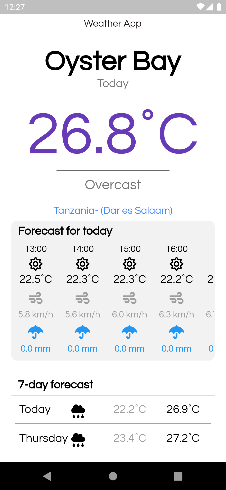

# Flutter Weather App 
This is a basic weather application built using Flutter and open-mateo.com weather api
## Features:
- Dark and Light Mode friendly
- Today Hourly Weather Forecast
- 7-day forecast
- Dynamic temperature color change based on temperature and location

## How it looks:
#### Dark mode ⚫ :

#### Light mode ⚪ :

## Please leave a ⭐ if you like it 💙

